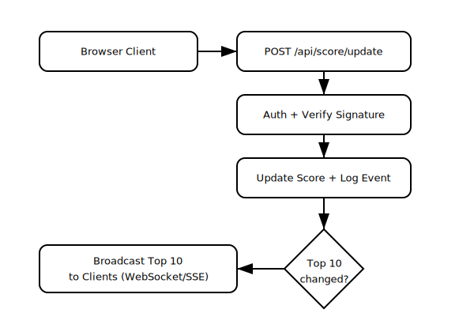
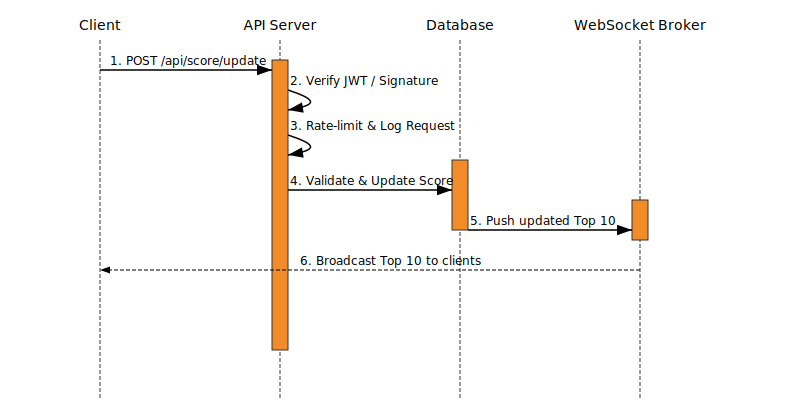

# Scoreboard Module Specification

## Overview

This module provides an API for updating and retrieving a real-time top-10 user scoreboard. It is designed to be secure, scalable, and extensible. It supports real-time push to clients and ensures data integrity through authentication and signature verification.

---

## Flow Diagram

Below is the execution flow for score update and real-time scoreboard broadcasting:



This diagram illustrates the overall system flow including API reception, score update, and live broadcasting.

---

## Sequence Diagram

The following diagram illustrates the sequential flow of how a user's score update is processed:



This sequence shows the step-by-step communication between Client, API Server, Database, and WebSocket Broker:

1. **Client → API Server**: `POST /api/score/update`
2. **API Server**: Verify JWT / Signature
3. **API Server**: Rate-limit and log request
4. **API Server → Database**: Validate and update score
5. **Database → WebSocket Broker**: Push updated top 10
6. **WebSocket Broker → Client**: Broadcast new top 10 to all clients

---

## Requirements

1. A public scoreboard page displays the top 10 users with the highest scores.
2. Users can perform specific actions that will increase their scores.
3. These actions trigger an API call to the backend to update the user’s score.
4. The scoreboard must update live without needing page refresh.
5. Score tampering by unauthorized users must be prevented.

---

## API Endpoints

### 1. `POST /api/score/update`

**Description:** Updates the user’s score after completing an action.

**Request Body:**

| Field       | Type   | Description                         |
| ----------- | ------ | ----------------------------------- |
| `userId`    | string | Authenticated user ID               |
| `actionId`  | string | Unique ID representing the action   |
| `signature` | string | HMAC or similar cryptographic proof |

**Security:**

- Requires authentication (JWT/session).
- Signature verification required to ensure authenticity.
- `actionId` must be unique per user to prevent replay attacks.
- Signature is expected to be an HMAC of `userId + actionId` using a shared secret.
- Optionally include a timestamp to prevent old action reuse.

**Response:**

```json
{ "message": "Score updated", "newScore": 123 }
```

---

### 2. `GET /api/scoreboard/top`

**Description:** Retrieves the current top 10 users by score.

Optional query parameters:

- `limit` (default: 10)
- `page` (default: 1) — for future support of paginated leaderboard.

**Response:**

```json
[
  { "userId": "u1", "username": "Alice", "score": 1500 },
  ...
]
```

---

## Security Considerations

- **Authentication:** All update requests must be authenticated.
- **Authorization:** Users can only update their own scores.
- **Replay Protection:** `actionId` must be tracked to prevent reuse.
- **Rate Limiting:** Prevent abuse by limiting requests per user.
- Signature payload should include a timestamp to ensure it expires.
- All endpoints must be served over HTTPS to prevent MITM attacks.

---

## Real-Time Updates

The scoreboard should be updated in real-time using a push mechanism. Possible implementations include:

- WebSocket
- Server-Sent Events (SSE)

Clients connected to the scoreboard page should receive updates automatically whenever the top-10 scores change.

For large-scale deployments, consider using a message queue such as Redis Pub/Sub or Kafka for broadcasting updates.

---

## Data Considerations

- A persistent store should track user scores and action history.
- Score changes should be event-logged to support audit and analytics.
- Leaderboard queries should be optimized for performance, potentially using caching strategies.
- If caching is used (e.g., Redis), ensure cache invalidation occurs only when top-10 changes to reduce unnecessary writes.

---

## Additional Notes

- The backend team can choose appropriate technologies to implement this module.
- Implementation should prioritize performance, security, and real-time responsiveness.
- Ensure the module is extensible for future enhancements (e.g., paginated leaderboards, scoring weights).

---

## Suggested Tech Stack

The following technologies are suggested for implementing this module effectively:

- **Backend Language:** Node.js (TypeScript) — modern, event-driven, and scalable.
- **Framework:** Express.js or Fastify — for lightweight, performant HTTP handling.
- **Database:** PostgreSQL — robust relational database suitable for transactional updates and ranking queries.
- **ORM/Query Builder:** Prisma or Knex.js — for secure, type-safe access to the database.
- **Authentication:** JSON Web Tokens (JWT) — for stateless, secure authentication.
- **Caching (optional):** Redis — for caching top-10 leaderboard to optimize read performance.
- **Real-Time Messaging:** WebSocket (via ws or socket.io) or Server-Sent Events (SSE) — for pushing live score updates to clients.
- **Message Broker (optional):** Redis Pub/Sub or NATS — for scalable real-time message distribution.
- **Logging & Monitoring:** Winston + Prometheus/Grafana.

The team may adjust components based on existing infrastructure and team expertise.

---

## Deployment Notes

- Ensure WebSocket or SSE endpoints are reachable through the load balancer.
- Use a process manager like PM2 or Docker to run the Node.js service reliably.
- Apply rate-limiting middleware (e.g., express-rate-limit) to avoid abuse.

---
